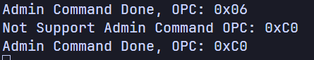
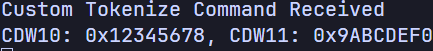
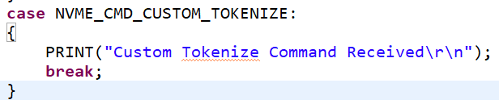

펌웨어 코드 수정 -> 커스텀 명령어 수신가능한지? 확인

nvme-cli 전송 명령어
sudo nvme admin-passthru /dev/nvme0n1 --opcode=0xC0 --cdw10=0x12345678 --cdw11=0x9abcdef0 --data-len=0 --namespace-id=1

sudo nvme admin-passthru /dev/nvme0n1 --opcode=0xC0 --cdw10=0x12345678 --cdw11=0x9abcdef0 --data-len=0 --namespace-id=1
sudo nvme io-passthru /dev/nvme0n1 --opcode=0xC0 --cdw10=0x12345678 --cdw11=0x9abcdef0 --data-len=0 --namespace-id=1

nvme 폴더에 nvme_io_cmd.c와 nvme_admin_cmd.c는 다른 역할을 수행한다.

